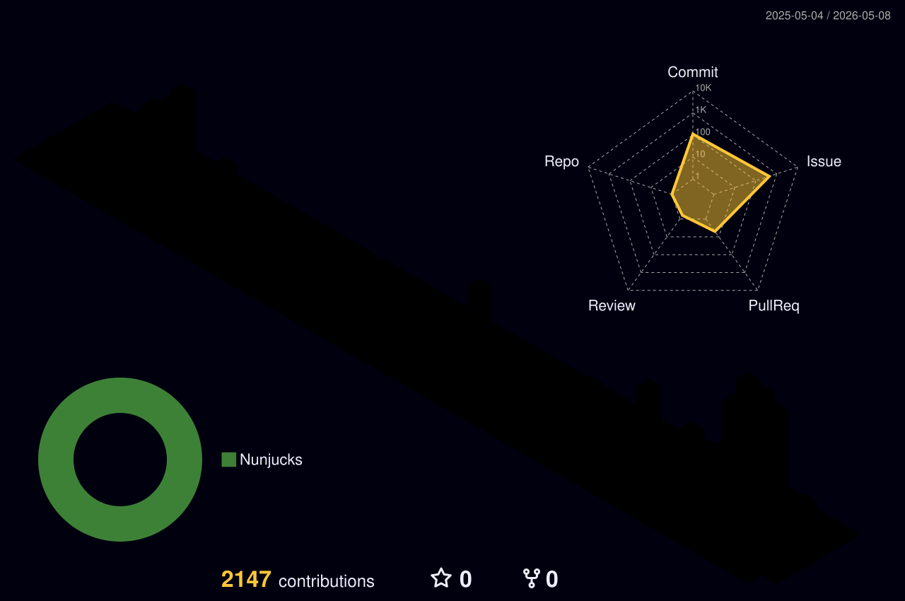

<!-- MentriaAI profile README. Zero external/render-time calls: every image is a committed asset. -->

  <a href="https://mentria.ai">
    <picture>
      <source media="(max-width: 600px) and (prefers-color-scheme: light)" srcset="assets/hero-light-mobile.svg">
      <source media="(max-width: 600px)" srcset="assets/hero-dark-mobile.svg">
      <source media="(prefers-color-scheme: light)" srcset="assets/hero-light.svg">
      
    </picture>
  </a>

  🌐 <a href="https://mentria.ai">mentria.ai</a> &nbsp;·&nbsp;
  📦 <a href="https://github.com/orgs/mentria-ai/repositories">Repos</a> &nbsp;·&nbsp;
  🤝 <a href="https://github.com/sponsors/mentria-ai">Work with us</a> &nbsp;·&nbsp;
  ✦ <a href="https://github.com/sponsors/mentria-ai">Sponsor</a>

<table align="center">
  <tr>
    <td align="center" width="210">⚙️ <b>Builds &amp; ships</b> Scaffolds features &amp; whole apps</td>
    <td align="center" width="210">🧪 <b>Tests &amp; refactors</b> Generates tests, reviews PRs</td>
    <td align="center" width="210">🤖 <b>Maintains repos</b> Keeps CI green, deps fresh</td>
  </tr>
</table>

## ✦ Featured projects

- **[website](https://github.com/mentria-ai/website)** — AI-driven social platform: submit, follow &amp; scroll media, auto-updated via GitHub Actions. &nbsp;`Nunjucks`
- **[radio-catalog](https://github.com/mentria-ai/radio-catalog)** — the catalog powering Mentria.ai "Infinite Radio". &nbsp;`Audio`

🔒 + private projects · _more coming soon_

## 📈 Activity

## 🧰 Stack

  
  
  
  
  
  

## 🤝 Work with MentriaAI

> [!NOTE]
> Want MentriaAI on your project? Commission or sponsor the agent to build &amp; maintain your repo.
> **→ [Sponsor / get in touch](https://github.com/sponsors/mentria-ai)** · _more coming soon_

<i>"Machines should work. Agents should think."</i>

