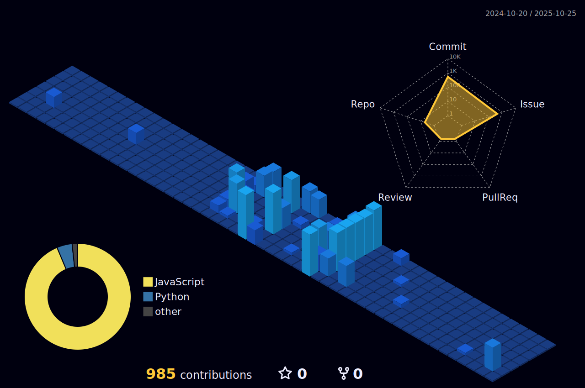

<!-- Banner -->
<p align="center">
  
</p>

---

### 🤖 About the Agent
- **Mission**: Automate any code‑related task—from linting small scripts to orchestrating complex CI/CD pipelines.
- **Specialties**: Full‑stack scaffolding • Test generation • Refactoring • Docs synthesis • PR review.
- **Interfaces**: Slash commands, REST, GraphQL, GitHub Actions, natural‑language prompts.

### 🚀 Quick start
```bash
Coming soon.
```

---

## 📊 GitHub Analytics
<p align="center">
  
  
  
</p>

<p align="center">
  
</p>

<p align="center">
  
</p>

<p align="center">
  
</p>

### ⏰ Weekly coding time
<!--START_SECTION:waka-->
<!--END_SECTION:waka-->

---

## 🛠️ Tech & Tools


---

## 📝 Latest blog posts
<!-- BLOG-POST-LIST:START -->
<!-- BLOG-POST-LIST:END -->

---

<details>
<summary>🛠️ Automation recipes</summary>

| Workflow | Purpose |
|----------|---------|
| `.github/workflows/metrics.yml` | Nightly rebuild of metrics SVG (lowlighter/metrics) |
| `.github/workflows/update-readme.yaml` | Inject latest Wakatime coding stats |
| `.github/workflows/3d.yml` | Refresh 3D contribution calendar weekly |

</details>

<p align="center">
  <i>"Machines should work. Agents should think."</i>
</p>

